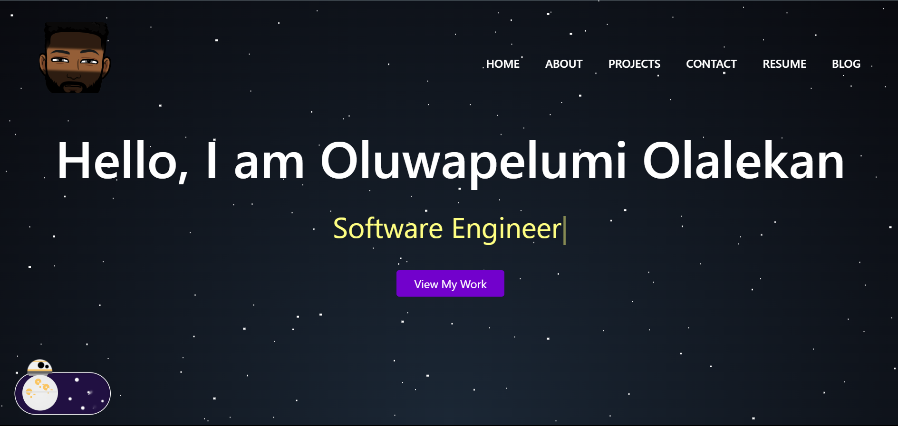

# My Portfolio Webpage 🌐

Welcome to the GitHub repository for my personal portfolio webpage! This project showcases my skills, experience, and projects in a visually appealing and user-friendly manner. Feel free to explore, provide feedback, or use this as inspiration for your own portfolio.

---

## 🚀 Live Demo

👉 Check out my portfolio live at [**one-pelumi-guy-portfolio.netlify.app**](https://one-pelumi-guy-portfolio.netlify.app)

---

## 📂 Project Overview

### 📝 Features:
- **About Me**: A brief introduction to who I am and what I do.
- **Skills**: My technical and soft skills.
- **Projects**: A showcase of my work, including descriptions, tech stacks, and links.
- **Contact Form**: A way to get in touch with me.
- **Star Wars Opening Crawl Easter Egg**: A hidden Star Wars-themed page that features the iconic opening crawl animation. May the Force be with you!

### 📷 Preview:
<p>

</p>

---

## 🛠️ Tech Stack

This portfolio was built using the following technologies:

- **Frontend**: ReactJS
- **Styling**: Sass, Bootstrap
- **Hosting**: Netlify

---

## ⚙️ Installation & Setup

If you want to run the project locally, follow these steps:

1. Clone this repository:
   ```bash
   git clone https://github.com/pelumi-guy/my-portfolio-webpage
   ```

2. Navigate to the project directory:
   ```bash
   cd my-portfolio-webpage
   ```

3. Install dependencies:
   ```bash
   npm install
   ```

4. Run the development server:
   ```bash
   npm start
   ```

5. Open [http://localhost:3000](http://localhost:3000) in your browser to view the project locally.

---

## 📧 Contact

Feel free to reach out to me if you have any questions or feedback:

- **Email**: [pelumi.olalekan.g@gmail.com](mailto:pelumi.olalekan.g@gmail.com)
- **LinkedIn**: [Oluwapelumi Olalekan](https://www.linkedin.com/in/oluwapelumi-olalekan-272b00153)
- **Twitter**: [@one_pelumi_guy](https://twitter.com/one_pelumi_guy")

---

## 🖼️ License

This project is licensed under the MIT License. You are free to use it as inspiration or a starting point for your own portfolio.

---

## 🙏 Acknowledgments

- **Special thanks to [Shlok Somani](https://github.com/shloksomani)** for the [React Dummy Portfolio Boilerplate](https://shloksomani.github.io/react-portfolio/) that served as the foundation for this project.
- Thanks to the open-source community for inspiration and resources.

---

### ⭐️ Contributions and Feedback
If you notice any issues or want to suggest improvements, feel free to open an issue or submit a pull request. Feedback is always welcome!